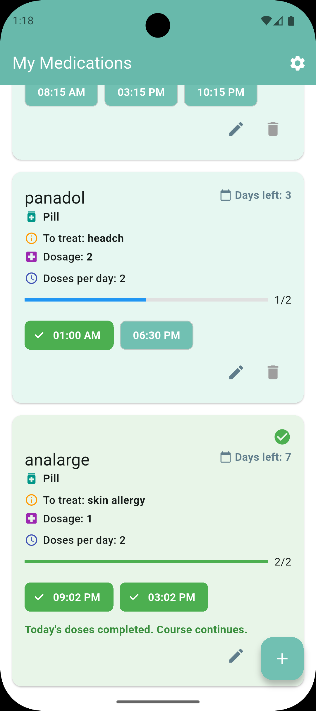
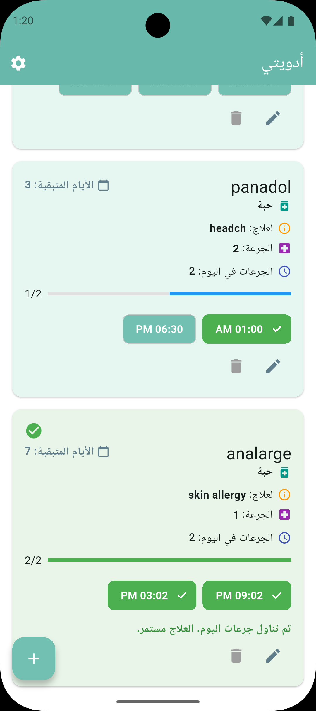
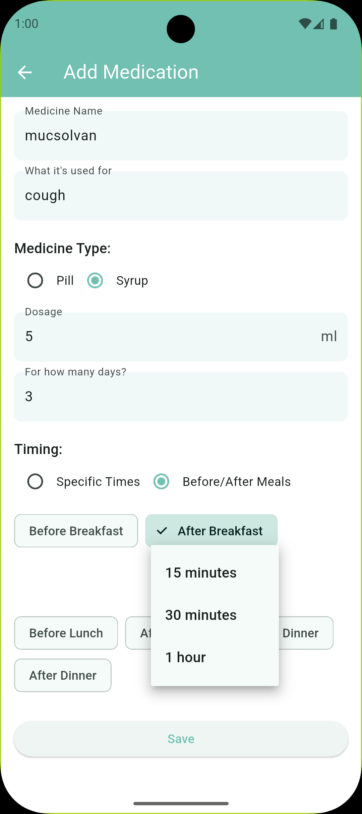
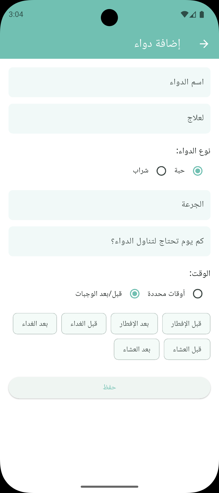
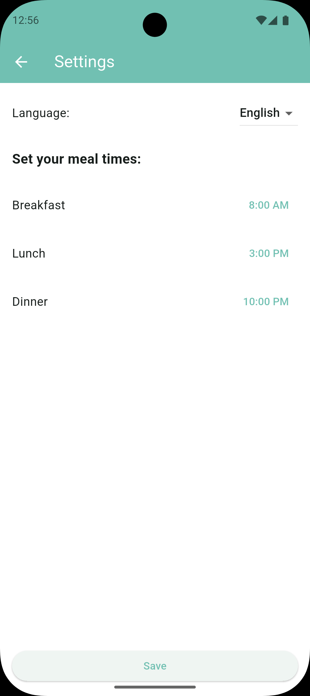
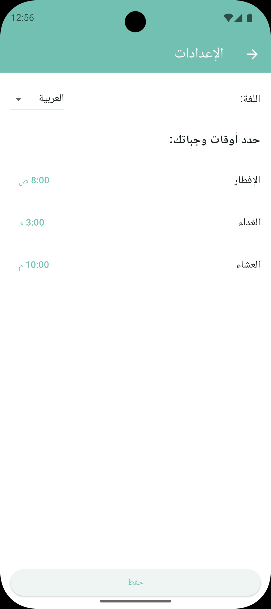
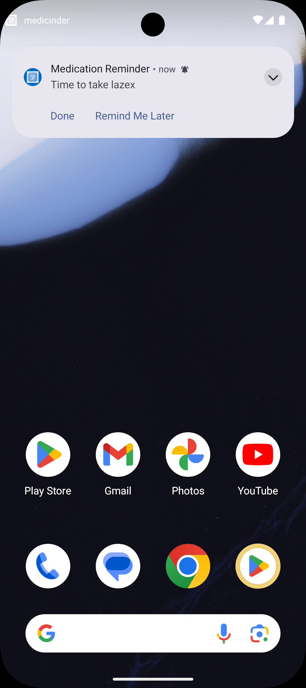
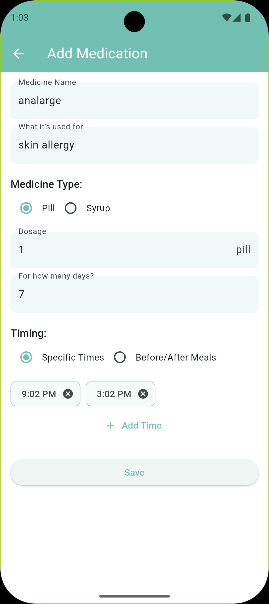

# Medicinder 💊

A comprehensive Flutter-based medication management app designed to help users track their medications, dosages, and schedules with ease.

## Features

### 🕐 **Smart Medication Scheduling**
- **Specific Time Scheduling**: Set exact times for medication doses
- **Meal-Based Scheduling**: Schedule medications relative to meals (before/after breakfast, lunch, dinner)
- **Flexible Timing**: Customizable time offsets for meal-based medications
- **Duration Tracking**: Set treatment duration in days with automatic completion

### 📱 **User-Friendly Interface**
- **Bilingual Support**: Available in English and Arabic with full localization
- **Intuitive Design**: Clean, modern UI with easy navigation
- **Cross-Platform**: Works on Android, iOS, Windows, macOS, Linux, and Web
- **Responsive Layout**: Adapts to different screen sizes and orientations

### 💊 **Medication Management**
- **Multiple Medication Types**: Support for pills and syrups
- **Dosage Tracking**: Record specific dosages with appropriate units
- **Usage Instructions**: Store detailed usage information for each medication
- **Smart Completion**: Automatic detection when treatment courses are finished
- **Manual Control**: Users can delete medications at any time

### 🔔 **Advanced Notification System**
- **Persistent Notifications**: Notifications stay visible until user action
- **Action Buttons**: "Done" and "Remind Me Later" options
- **Background Processing**: Works even when the app is closed
- **Automatic Scheduling**: Notifications scheduled when medications are added
- **Smart Rescheduling**: 15-minute delay option for missed doses
- **High Priority**: Notifications can wake the device

### 💾 **Data Persistence**
- **Local Storage**: Hive database for offline access
- **Data Migration**: Automatic handling of model structure changes
- **Cross-Platform**: Consistent data across all platforms

## Screenshots

### 📱 Main Interface

#### English Version

*Main medication list with dose tracking*

#### Arabic Version

*Main medication list with dose tracking (RTL layout)*

### 💊 Add Medication

#### English Version

*Easy medication addition with flexible timing options*

#### Arabic Version

*Easy medication addition with flexible timing options (RTL layout)*

### ⚙️ Settings & Localization

#### English Version

*Bilingual support and meal time configuration*

#### Arabic Version

*Bilingual support and meal time configuration (RTL layout)*

### 🔔 Notification System

*Smart notification system with action buttons for dose tracking*

### 📝 Additional Screenshots

#### Alternative Add Medication View

*Alternative view of medication addition form*

> **Note**: The app supports both English and Arabic languages with full RTL (Right-to-Left) layout support for Arabic users.

## Getting Started

### Prerequisites
- Flutter SDK (3.8.1 or higher)
- Dart SDK
- Android Studio / VS Code
- Git

### Installation

1. **Clone the repository**
   ```bash
   git clone https://github.com/MeDoRa0/medicinder.git
   cd medicinder
   ```

2. **Install dependencies**
   ```bash
   flutter pub get
   ```

3. **Generate code** (for Hive models)
   ```bash
   flutter packages pub run build_runner build
   ```

4. **Run the app**
   ```bash
   flutter run
   ```

## Architecture

This project follows Clean Architecture principles with the following structure:

```
lib/
├── core/           # Core functionality, DI, and services
│   ├── di/        # Dependency injection setup
│   └── services/  # Notification and background services
├── data/          # Data layer (models, repositories, data sources)
├── domain/        # Business logic (entities, use cases, repositories)
├── presentation/  # UI layer (pages, widgets, state management)
└── l10n/         # Localization files
```

### Key Technologies
- **Flutter**: Cross-platform UI framework
- **Cubit (flutter_bloc)**: State management
- **Hive**: Local data persistence
- **Awesome Notifications**: Advanced notification system
- **WorkManager**: Background task processing
- **GetIt**: Dependency injection
- **Clean Architecture**: Scalable code structure

### Dependencies

#### Core Dependencies
- `flutter_bloc: ^9.1.1` - State management
- `hive: ^2.2.3` - Local database
- `awesome_notifications: ^0.10.1` - Advanced notifications
- `workmanager: ^0.6.0` - Background processing
- `get_it: ^8.0.3` - Dependency injection
- `timezone: ^0.10.1` - Timezone handling
- `uuid: ^4.5.1` - Unique ID generation

#### Development Dependencies
- `build_runner: ^2.5.3` - Code generation
- `hive_generator: ^2.0.1` - Hive model generation
- `flutter_launcher_icons: ^0.13.1` - App icon generation

## Features in Detail

### Notification System
The app uses Awesome Notifications for a robust notification experience:
- **Persistent notifications** that don't auto-dismiss
- **Action buttons** for quick dose tracking
- **Background processing** with WorkManager
- **Automatic scheduling** based on medication timing
- **Smart rescheduling** for missed doses

### Data Management
- **Hive database** for fast, local storage
- **Automatic data migration** for model changes
- **Cross-platform consistency** across all devices
- **Offline-first** approach for reliability

### Localization
- **English and Arabic** support
- **RTL layout** support for Arabic
- **Dynamic language switching** without app restart
- **Comprehensive translations** for all UI elements

## Contributing

1. Fork the repository
2. Create your feature branch (`git checkout -b feature/AmazingFeature`)
3. Commit your changes (`git commit -m 'Add some AmazingFeature'`)
4. Push to the branch (`git push origin feature/AmazingFeature`)
5. Open a Pull Request

### Development Guidelines
- Follow Clean Architecture principles
- Use Cubit for state management
- Add proper error handling
- Include localization for new strings
- Test on multiple platforms

## License

This project is licensed under the MIT License - see the [LICENSE](LICENSE) file for details.

## Author

**Mohamed Hossam** - [MeDoRa0](https://github.com/MeDoRa0)

## Acknowledgments

- Flutter team for the amazing framework
- The open-source community for inspiration and tools
- All contributors and testers
- Awesome Notifications team for the robust notification system

---

⭐ **Star this repository if you find it helpful!**
