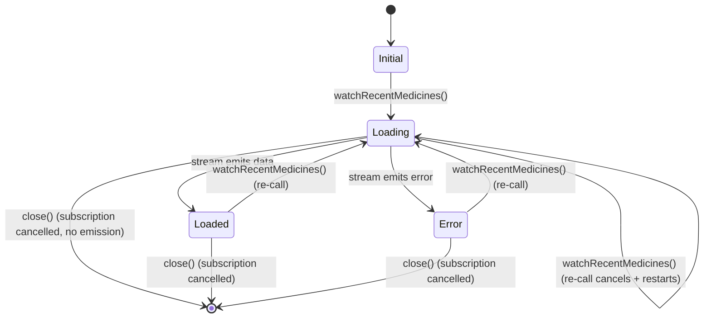

# Data Model: Last Taken Medicine — Phase 5 Testing

**Feature Branch**: `015-last-taken-testing` | **Date**: 2026-04-17

## Entities Under Test

This feature does not introduce new entities. All entities below are pre-existing
from Phases 1–4 and are documented here for test reference.

### MedicationHistory (Domain Entity)

**File**: `lib/domain/entities/medication_history.dart`

| Field | Type | Description |
|-------|------|-------------|
| `medicineId` | `String` | Unique identifier for the medication |
| `medicineName` | `String` | Display name of the medication |
| `dose` | `String` | Dose description (e.g., "500 mg", "2 Pills") |
| `takenAt` | `DateTime` | UTC timestamp when the medication was taken |

**Behaviors**:
- Extends `Equatable` with `props => [medicineId, medicineName, dose, takenAt]`
- Value equality: two instances with identical fields are `==`
- Immutable (all fields `final`)

### LastTakenMedicinesState (Cubit State)

**File**: `lib/features/medication/presentation/cubit/last_taken_medicines_state.dart`

| Variant | Fields | Props |
|---------|--------|-------|
| `LastTakenMedicinesInitial` | — | `[]` |
| `LastTakenMedicinesLoading` | — | `[]` |
| `LastTakenMedicinesLoaded` | `medications: List<MedicationHistory>` | `[medications]` |
| `LastTakenMedicinesError` | `message: String` | `[message]` |

**Behaviors**:
- All extend `Equatable`
- All are `const`-constructible
- `Loaded` with empty list is a valid state (triggers empty state UI)

### MedicationHistoryModel (Data Model)

**File**: `lib/data/models/medication_history_model.dart`

- Hive-persisted (`@HiveType(typeId: 7)`)
- Provides `toEntity()` → `MedicationHistory`
- Provides `fromEntity(MedicationHistory)` factory
- Used by `MedicationHistoryLocalDataSource` and `MedicationRepositoryImpl`

## State Transitions



## Filtering Rule

```
threshold = DateTime.now().toUtc() - 24 hours
include if: record.takenAt > threshold    // STRICT greater-than
exclude if: record.takenAt <= threshold   // exactly 24h = excluded
```

> **Bug noted**: Current implementation uses `>=` (inclusive). Must be fixed to `>` (strict).
